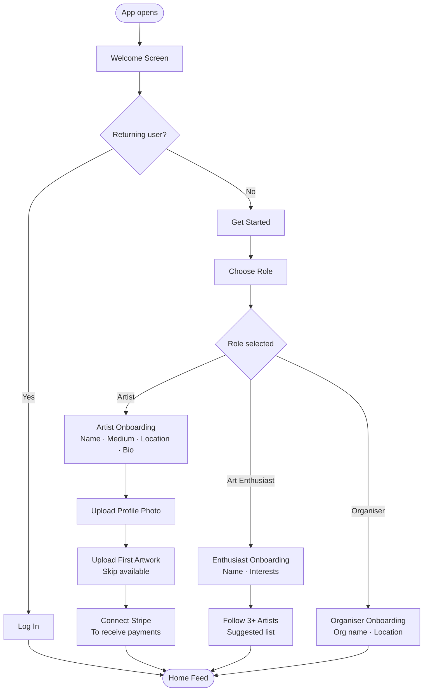
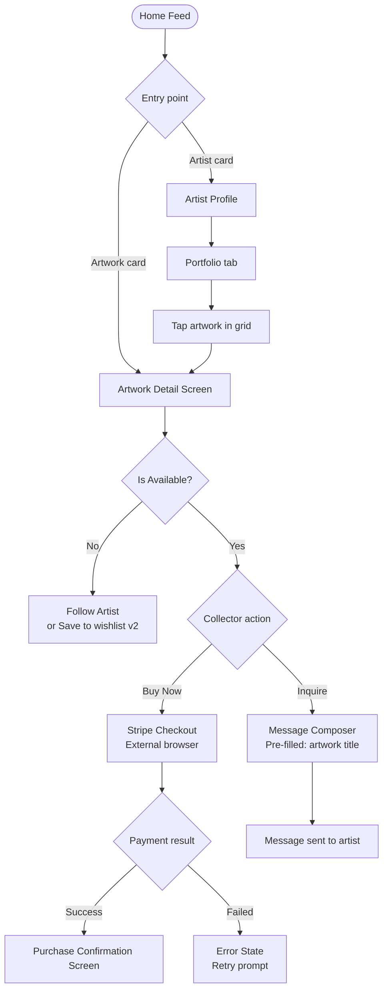
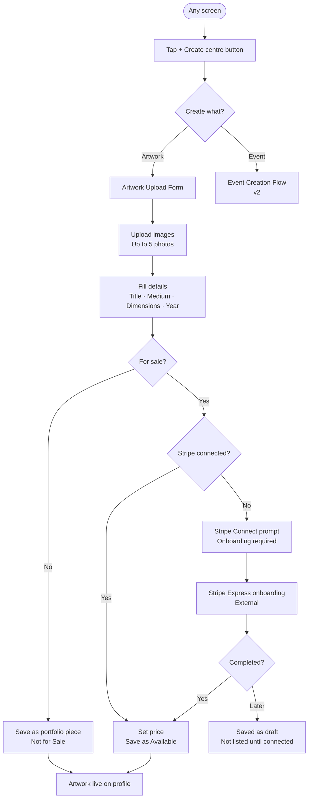
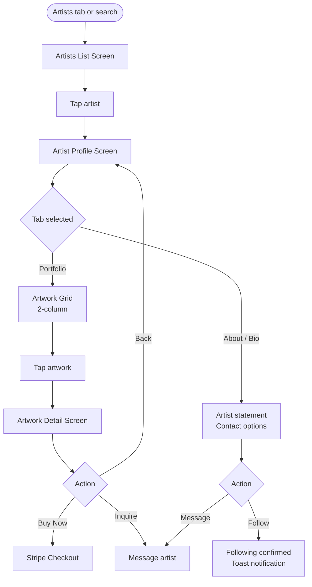
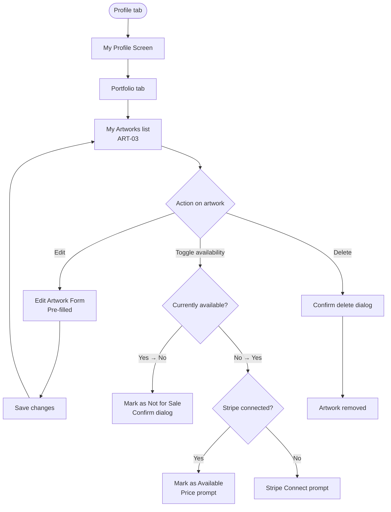

# FrontStreet — UX/UI Design Document I

**Document type:** UX/UI Planning Reference  
**Product:** FrontStreet — Boston Black Art Platform  
**Audience:** Solo founder/developer — George Freeman, FromStreet2Canvas LLC  
**Sources:** FrontStreet Market Research (March 2026), FrontStreet Technical Architecture (March 2026)  
**Last updated:** March 2026  

> Every design decision in this document is grounded in the market research and technical architecture already documented in this vault. No assumptions are made that aren't supported by those documents.

---

## Table of Contents

1. [[#1. Design Philosophy]]
2. [[#2. UI and UX References]]
3. [[#3. Colour Palette]]
4. [[#4. Typography]]
5. [[#5. Component Recommendations]]
6. [[#6. Key User Flows]]
7. [[#7. Screen Inventory]]
8. [[#8. Empty States]]
9. [[#9. Developer Handoff Notes]]

---

## 1. Design Philosophy

### What the Research Demands

The market research makes one thing unmistakably clear: FrontStreet's competitive moat is **cultural authenticity**. Not features, not pricing, not technology — cultural specificity. Every competitor that exists (Artsy, Instagram, Eventbrite, BAIA) is either global and generic, or culturally specific but incomplete. None combine the three core functions (profiles, events, sales) for a hyper-local Black arts community.

That gap is also a design brief. The UI must *feel* like it was built for this community — not as a skin over a generic template, but as something that emerged from the culture it serves.

Three questions should be asked of every design decision:

1. **Does this serve the art, or compete with it?** Artwork and artist photography are the product. Chrome — buttons, navbars, labels, backgrounds — should recede. Imagery leads.
2. **Does this feel like Black Boston, or Silicon Valley?** A cold white interface signals "designed for the default user." Warmth, depth, and cultural resonance signal "designed for you."
3. **Can one developer build and maintain this?** The technical architecture established Quasar as the framework precisely because it ships 80+ production-ready components. Every design decision maps to a component that already exists.

### Three Core Principles

**Principle 1 — Art leads, interface follows**  
The research shows 51% of collectors purchased art through Instagram in 2024 — proving the visual discovery behaviour already exists. The problem isn't demand; it's that the container (Instagram) was never designed for this audience. FrontStreet's design steals Instagram's visual-first UX pattern but removes everything that works against Black artists: algorithmic suppression, no sales infrastructure, no event tools, no cultural context.

Artwork images are the first thing a user sees on every major screen. Navigation and labels are minimal, quiet, and never compete.

**Principle 2 — Warmth signals belonging**  
The research cites cultural authenticity as the primary moat: "a platform built by a Black Boston artist carries trust that generic Silicon Valley marketplaces never will." Design signals this through colour temperature, typography character, and the emotional register of copy in empty states, onboarding, and confirmations. Dark, warm, gallery-like — not light, clinical, tech-startup.

**Principle 3 — Scope discipline is also a design principle**  
The research is explicit: the MVP is 11 features, not 40. Events and the AI discovery feed are deferred to v2. This document designs for that scope. Designing screens that won't be built for months wastes time and creates scope creep risk. Everything here is buildable in the 12-week schedule.

### Design Mode

**Dark-first.** The technical architecture and market research both land here independently:
- Gallery walls are dark so artwork pops — same principle applies on screen
- The research identifies FrontStreet's collector base as 18–39 year olds who buy on mobile; dark UIs read as premium and culturally current to this demographic
- Warm dark backgrounds (near-black with amber undertones, not pure black) make photography glow rather than float

---

## 2. UI and UX References

### Primary References

#### Instagram — Visual Discovery Pattern
**What to borrow:**
- Square/portrait image grid for artwork browsing
- Pull-to-refresh discovery metaphor
- Artist profile structure: cover image banner + circular avatar overlay + stat row (artworks, followers) + tab navigation below
- Horizontal scroll carousels for featured/curated content rows
- Bottom tab navigation with five slots

**What to reject explicitly:**
- The algorithm that the research confirms suppresses Black creators
- General-purpose feed with no cultural curation
- Zero sales infrastructure (no price, no buy path)
- Zero event infrastructure
- No distinction between an art platform and a meme account

**Why this is the right reference:** The research shows collectors already buy art through Instagram. The behavioural pattern (scroll, tap, browse) is trained. FrontStreet borrows the familiarity and removes the dysfunction.

---

#### Eventbrite — Event Listing Pattern
**What to borrow:**
- Event card structure: hero image, event title, date+time line, venue/location line
- Event type filtering (category chips: Exhibition, Pop-Up, Workshop, Talk, Mixer)
- RSVP / ticket CTA as the primary action on every event card and detail screen
- Calendar add as a secondary action

**What to reject explicitly:**
- 10–14% ticket fees (research shows this is punishing for community events; FrontStreet's model is 3% + $0.50)
- No artist profiles, no community, no cultural identity
- Disconnect between event and the artists featured at it

**Why this is the right reference:** Eventbrite invented the vocabulary for digital event ticketing. Users know what an event card looks like and what RSVP means. Borrow the pattern; build a better product around it.

---

#### Saatchi Art — Artwork Detail Page Pattern
**What to borrow:**
- Full-bleed artwork image at top, scrollable metadata below
- Structured detail row: Title, Year, Medium, Dimensions, Price
- Availability badge (Available / Not for Sale) prominent near price
- Dual CTA: "Inquire" (softer) and "Buy Now" (primary)
- Artist mini-card below the artwork — name, avatar, link to full profile

**What to reject explicitly:**
- 35–45% commission (FrontStreet's model is 5–8%)
- Global, impersonal scope with no local community context
- Gallery-gated listings (on FrontStreet, artists list directly)

---

#### Are.na — Tonal Mood Reference (not UX pattern)
Are.na is a visual research and collection tool used by designers and artists. Its specific relevance here is *how it frames content* — generous whitespace (even on dark backgrounds), deliberate typography, the sense that each image or item is treated as worthy of attention rather than optimised for engagement. This is the register for FrontStreet's **artwork detail screens** specifically: slow down, let the piece breathe, give the metadata room.

---

### Mobile UX Pattern References

**Bottom tab bar (5-slot, centre action elevated)**  
Standard on creator-focused apps (Instagram, TikTok, Clubhouse). The centre slot is the Create action — visually elevated above the bar line. This pattern communicates the app's primary purpose: creating and sharing. In Quasar, this is `QTabsBottom` with a custom centre `QBtn`.

**Section-headed vertical scroll (not infinite scroll)**  
Infinite scroll optimises for time-on-app. FrontStreet doesn't need to maximise session length — it needs to drive artwork purchases and event RSVPs. Named, purposeful sections ("Spotlighted Works", "Featured Artists", "Upcoming Events") give users clear entry points and make the feed feel curated rather than algorithmic. This also significantly reduces frontend complexity for a solo developer.

**Skeleton loading (not spinners)**  
Skeleton screens hold the visual layout while content loads. Spinners leave blank space. For an art-heavy app where large images are the primary content, skeletons prevent layout jump and communicate structure. Quasar ships `QSkeleton` natively.

---

## 3. Colour Palette

### Philosophy

The research describes the community FrontStreet serves: African American, Haitian, Cape Verdean, Jamaican, and Ethiopian communities anchored in Roxbury. Nubian Square. BAMS Fest. The National Center of Afro-American Artists. This is a community with a rich visual culture — warm earth tones, deep jewel colours, the colour language of African textiles, kente, pottery, earthen pigments.

A cold tech-startup palette (grey-on-white, electric blue CTAs) would signal the opposite of belonging. The palette below is warm, deep, and gallery-quality.

---

### Core Palette

```
─────────────────────────────────────────────────────────
BACKGROUNDS
─────────────────────────────────────────────────────────
Surface 0 (Page background)    #0D0D0D    Near-black with warmth. Gallery wall.
Surface 1 (Cards, sheets)      #1A1A1A    Slightly lifted. Art card backgrounds.
Surface 2 (Inputs, modals)     #262626    Elevated surfaces. Form fields, drawers.

─────────────────────────────────────────────────────────
TEXT
─────────────────────────────────────────────────────────
Text Primary                   #F5F0E8    Warm white — not pure white. Candlelit.
Text Secondary                 #A89880    Warm tan. Captions, metadata, timestamps.
Text Disabled                  #5C5147    Placeholder text, inactive labels.

─────────────────────────────────────────────────────────
BRAND
─────────────────────────────────────────────────────────
Brand Primary                  #C4702A    Burnt orange / deep amber.
Brand Primary Dark             #9E5720    Pressed / active state.
Brand Primary Light            #E8914E    Hover / highlight.

Brand Accent                   #7B4FA6    Deep violet. Secondary actions, tags.
Brand Accent Light             #A87FD0    Links, hover on accent elements.

─────────────────────────────────────────────────────────
SEMANTIC
─────────────────────────────────────────────────────────
Success                        #4CAF72    Available badge, RSVP confirmed.
Warning                        #E8A020    Expiring listings, waitlist status.
Error                          #D95454    Form errors, sold-out states.
Info                           #4A90D9    Informational nudges, tooltips.
─────────────────────────────────────────────────────────
```

### Rationale by Colour

**#0D0D0D — Near-Black Background**  
Galleries have dark walls for a reason: work pops against them. Pure black (#000000) reads as harsh. #0D0D0D has a fractional warmth that makes it feel intentional rather than default. Every competitor (Artsy web, Instagram, Eventbrite) uses white or light grey. Dark-first is the immediate visual signal that FrontStreet is different.

**#C4702A — Brand Primary (Burnt Orange / Deep Amber)**  
Amber and terracotta are deeply embedded in African and African-American visual culture — from West African textiles to Afrofuturist art direction to the warm tones of documentary photography from the Black American experience. This is not an arbitrary choice. It connects the brand to the culture it serves. It also reads as warm, grounded, and earthy — the opposite of the cold electric blues that dominate tech product colour systems.

**#7B4FA6 — Brand Accent (Deep Violet)**  
Violet carries historical weight: royalty, spirituality, elevation. In the context of a platform explicitly built to elevate Black artists, it's not an accident. It also provides strong visual contrast against the burnt orange primary — the two colours are analogous on the warm-to-cool spectrum, separated enough to be distinct but harmonious enough to coexist. Violet is used for secondary actions, event type chips, and links — it never competes with the primary CTA colour.

**#F5F0E8 — Text Primary (Warm White)**  
Pure white against near-black reads as the Apple aesthetic — clean, but cold and corporate. Warm white with a slight amber cast (#F5F0E8) reads as candlelit — like the lighting in an intimate gallery opening. The psychological difference is subtle but cumulative across hundreds of moments in the app.

**#4CAF72 — Success (Green)**  
Used *only* for transactional confirmation: "Available" artwork badge, "RSVP Confirmed", "Purchase Complete". Not used for general positive sentiment or decorative purposes. Scarcity of the success colour keeps it meaningful.

### Quasar Theme Variables

Add to `src/css/quasar.variables.scss`:

```scss
$primary   : #C4702A;
$secondary : #7B4FA6;
$accent    : #E8914E;
$positive  : #4CAF72;
$negative  : #D95454;
$info      : #4A90D9;
$warning   : #E8A020;

$dark      : #0D0D0D;
$dark-page : #0D0D0D;
```

Set `dark: true` in `quasar.config.js` under `framework.config` to activate dark mode globally across all Quasar components.

### Usage Rules

- Artwork images are **never** placed over a coloured background — always over Surface 0 or Surface 1.
- Brand Primary (#C4702A) is for: primary CTAs only, active nav state, "Available" badge, featured content markers.
- Brand Accent (#7B4FA6) is for: links, secondary buttons, event type chips, hover states.
- Success green is reserved exclusively for transactional confirmations — never decorative.
- Do not introduce additional colours outside this palette during MVP. Consistency requires discipline.

---

## 4. Typography

### Philosophy

The research notes that FrontStreet's moat is cultural authenticity — and typography is one of the fastest signals a user processes unconsciously. Roboto and San Francisco (the default fonts on Android and iOS) are invisible in the worst way: they signal "I didn't make a typographic choice." FrontStreet needs a type system with enough character to signal intentionality, while remaining legible at small mobile sizes.

### Selected Typefaces

**Display — `DM Serif Display`**  
Serif. Used for artist names on profile headers, large event titles, hero copy. The deliberate choice of a serif display font on a dark background is a direct reference to editorial design — gallery catalogues, art magazines, exhibition programmes. It communicates that this is a serious arts platform, not a general marketplace. Free on Google Fonts.

**UI / Body — `Inter`**  
Sans-serif. The workhorse. All interface text: nav labels, body copy, form fields, captions, button text. Inter was designed specifically for screen legibility at small sizes. Its neutrality is intentional — it recedes and lets DM Serif Display carry the brand identity. Free on Google Fonts.

**Price / Data — `JetBrains Mono`**  
Monospace. Used exclusively for price display and numerical data. A price tag in monospace reads like a label in a gallery — precise, considered, not decorative. "$2,500" in Inter is a number. "$2,500" in JetBrains Mono is a statement. Free on Google Fonts.

### Type Scale

| Role | Typeface | Size | Line Height | Usage |
|---|---|---|---|---|
| Display XL | DM Serif Display | 32px | 40px | Artist names on profiles, hero headlines |
| Display L | DM Serif Display | 24px | 32px | Event titles, section headers |
| Body L | Inter | 18px | 28px | Artist statements, event descriptions |
| Body M | Inter | 16px | 24px | Standard body copy, card content |
| Body S | Inter | 14px | 20px | Captions, metadata, timestamps |
| Label | Inter | 12px | 16px | Chips, badges, tab labels, form hints |
| Price | JetBrains Mono | 18px | 24px | Artwork prices, ticket prices |

### Weights

| Weight | Usage |
|---|---|
| Inter 400 Regular | Body copy, descriptions, captions |
| Inter 500 Medium | Navigation labels, secondary headings |
| Inter 600 SemiBold | Card titles, button text, section headers |
| DM Serif Display 400 | All display use (single weight available) |
| JetBrains Mono 600 | Prices — SemiBold for visual emphasis |

### Implementation in Quasar

Load via Google Fonts in `index.html` — only the specific weights listed above. Loading full font weight ranges adds unnecessary bundle size.

```scss
// src/css/app.scss

// Display font utility class
.text-display {
  font-family: 'DM Serif Display', serif;
  font-weight: 400;
}

// Price utility class
.text-price {
  font-family: 'JetBrains Mono', monospace;
  font-weight: 600;
  letter-spacing: -0.01em;
}

// Override Quasar's default font
$typography-font-family: 'Inter', sans-serif;
```

---

## 5. Component Recommendations

Every component listed here is a Quasar component that ships out of the box. No custom engineering required for MVP. The design challenge is configuration and theming — not building from scratch.

### Navigation

**Bottom Tab Bar**  
Component: `QTabsBottom` + `QRouteTab`  
Five slots: Home (icon: `home`), Events (icon: `calendar_today`), **Create** (centre, elevated), Artists (icon: `people`), Profile (icon: user avatar or `account_circle`).  
The centre Create slot uses `QFab` with `color="primary"` and `round` to sit visually above the tab bar. This is the most critical navigation pattern — it communicates at a glance that this is a creator platform.

**App Header**  
Component: `QHeader` + `QToolbar` + `QToolbarTitle`  
Minimal. Brand wordmark ("FrontStreet" in DM Serif Display or a custom SVG logo) left-aligned. Search icon (`QBtn` with `flat` + `QIcon search`) right-aligned. On interior screens (profile, detail, creation): replaced by `QBtn back arrow` left + screen title centred.

---

### Cards

**Artwork Card — Browse Feed, Grid Views**  
Components: `QCard` + `QImg` + `QCardSection` + `QBadge`  
- Image: `QImg` with `ratio="1"` (square) or `ratio="0.75"` (portrait). Always the top element.
- Badge: `QBadge` positioned `absolute-top-right` with `color="positive"` for Available, `color="grey-7"` for Not for Sale.
- Section below image: artwork title in Inter 600 14px + artist name in Inter 400 12px Text Secondary.
- Price: `text-price` class, Inter Mono 14px, warm white.
- Card style: `flat` (no border), `border-radius: 12px`, background Surface 1 (#1A1A1A).

**Event Card — Events Feed**  
Components: `QCard` + `QImg` + `QCardSection` + `QChip` + `QCardActions`  
- Image: `QImg` with `ratio="16/9"` hero image.
- Event type chip: `QChip` with `color="secondary"` (violet), small, above or overlaid on image.
- Section: Event title in Inter 600 16px + date row (`QIcon` `calendar_today` + date string) + location row (`QIcon` `place` + venue name), all in Body S size, Text Secondary colour.
- Actions: `QBtn` "RSVP" (filled, primary colour) + `QBtn` "Save" (flat, text-only).

**Artist Card — Featured Row, Horizontal Scroll**  
Components: `QCard` + `QAvatar` + `QCardSection` + `QBtn`  
- Horizontal layout: `QAvatar` 56px left + name/medium stack centre + Follow `QBtn` right.
- Used inside `QScrollArea` horizontal for the Featured Artists row on Home screen.
- Artist name: Inter 600 14px. Medium: Inter 400 12px Text Secondary.

**Featured Artwork Hero — Home Screen Carousel**  
Components: `QCarousel` + `QCarouselSlide` + `QImg`  
- Full-width, height 65vw. Swipeable left/right. Auto-plays slowly (5s per slide).
- Overlay at bottom of each slide: artwork title in DM Serif Display 20px + price in JetBrains Mono + artist name.
- Navigation arrows hidden on mobile (swipe only). Dots indicator below.

---

### Forms

**Auth — Sign Up / Log In**  
Components: `QForm` + `QInput` + `QBtn` + `QSeparator`  
- `QInput` with `outlined` prop and `dark` prop. Labels **above** the field (not floating — floating labels are harder to scan).
- Password field: `QInput` type password + `QIcon` in `append` slot to toggle visibility.
- Social login: `QBtn` outline with Google/Apple icons. `QSeparator` with "or" label between social and email/password sections.

**Artwork Upload**  
Components: `QForm` + `QFile` + `QInput` + `QSelect` + `QToggle`  
- Image upload: `QFile` with drag-and-drop enabled (web) and camera/gallery access (mobile via Capacitor).
- Medium: `QSelect` with options: Painting, Sculpture, Photography, Mixed Media, Digital, Other.
- Available toggle: `QToggle` — when toggled ON, price input appears conditionally.
- Price: `QInput` type number, shown only when Available = true.
- Form validation: `QForm` handles validation display. Required fields: title, at least 1 image, medium.

**Profile Edit**  
Components: `QForm` + `QInput` + `QSelect` + `QFile`  
- Profile photo: `QFile` triggering `QAvatar` preview update.
- Medium(s): `QSelect` with `multiple` prop — artist can select more than one.
- Bio: `QInput` with `type="textarea"` and `autogrow`.
- Social links: `QInput` fields for Instagram, website — optional.

---

### Lists

**Artists List**  
Components: `QList` + `QItem` + `QItemSection` + `QAvatar` + `QItemLabel`  
Standard Quasar list. Avatar left, name + medium stack centre, Follow button right. `QSlideItem` can add swipe-to-follow gesture as a v2 enhancement.

**Events List**  
Components: `QList` + `QItem` + `QItemSection`  
Thumbnail image left (56×56 `QImg`), event title + date + location stack right. Tap → Event Detail screen. `QSeparator` between items for visual breathing room.

---

### Feedback and Overlays

**All Loading States → `QSkeleton`**  
Use `QSkeleton` with `type="rect"` and fixed height matching the expected card before data loads. Never a raw spinner on its own. Never a blank screen. Skeleton screens communicate structure and prevent layout shift when content arrives.

**Destructive Confirmations → `QDialog`**  
Two-button `QDialog`: Cancel (flat, text-only) + Confirm action (filled, `color="negative"`). Used for: delete artwork, cancel RSVP.

**Toast Notifications → Quasar `Notify` plugin**  
`$q.notify({ message: '...', color: 'positive', position: 'top', timeout: 2500 })` for success states (RSVP confirmed, artwork saved, profile updated). Keep copy direct and brief.

**Image Fullscreen → `QDialog` fullscreen + `QImg`**  
Tapping any artwork image opens a fullscreen `QDialog` with the image filling the screen. Close on swipe-down gesture (Capacitor touch gesture). This is the closest mobile equivalent to "stepping closer to a painting."

**Pull-to-Refresh → `QPullToRefresh`**  
Wraps all scrollable feed views: Home, Events, Artists List.

---

### Badges and Tags

| Element | Component | Colour | Usage |
|---|---|---|---|
| Available | `QBadge` | `positive` (#4CAF72) | Artwork is for sale |
| Not for Sale | `QBadge` | `grey-7` | Artwork shown but unavailable |
| Featured | `QBadge` | `primary` (#C4702A) | Paid featured placement slot |
| Event type | `QChip` | `secondary` (#7B4FA6) | Exhibition, Pop-Up, Workshop, Talk, Mixer |
| New | `QBadge` | `accent` (#E8914E) | Newly listed artwork (first 48hrs) |

---

## 6. Key User Flows

### Flow 1 — New User Onboarding



---

### Flow 2 — Collector Discovers and Purchases Artwork



---

### Flow 3 — Artist Creates and Lists an Artwork



---

### Flow 4 — Collector Views Artist Profile



---

### Flow 5 — Artist Manages Their Listings



---

## 7. Screen Inventory

MVP scope only, aligned to the 12-week build schedule from the Technical Architecture document. Screens marked `[v2]` are deferred — do not build during MVP sprint.

### Auth & Onboarding

| ID | Screen | Primary Purpose |
|---|---|---|
| AUTH-01 | Welcome / Splash | First impression. Hero visual, tagline, Get Started + Log In CTAs. |
| AUTH-02 | Role Selection | Artist / Art Enthusiast / Organiser. Sets profile type and onboarding branch. |
| AUTH-03 | Sign Up | Email + password form. Google and Apple SSO buttons. |
| AUTH-04 | Log In | Email + password. SSO. Forgot password link. |
| AUTH-05 | Artist Onboarding | Name, medium(s), location, bio, profile photo upload. |
| AUTH-06 | Enthusiast Onboarding | Name, interests, neighbourhood preference for event relevance. |

### Home / Discovery

| ID | Screen | Primary Purpose |
|---|---|---|
| HOME-01 | Home Feed | Spotlighted Works carousel + Featured Artists row + Upcoming Events list. |
| HOME-02 | Search | Search bar + recent searches + category filter chips. |
| HOME-03 | Search Results | Artist / Artwork results in toggle tabs. |

### Artist Profiles

| ID | Screen | Primary Purpose |
|---|---|---|
| ARTIST-01 | Artists List | All artists, scrollable. Filter by medium. |
| ARTIST-02 | Artist Profile | Cover image, avatar, name, medium, stats. Tabs: Portfolio / About. |
| ARTIST-03 | My Artworks | Artist's own listing management — edit, toggle available, delete. |
| ARTIST-04 | Edit Profile | Update bio, photo, medium, social links. |

### Artwork

| ID | Screen | Primary Purpose |
|---|---|---|
| ART-01 | Artwork Detail | Full image, metadata, price, availability. Buy Now / Inquire CTAs. Artist mini-card. |
| ART-02 | Upload Artwork | Image upload (up to 5), title, medium, dimensions, year, price, availability toggle. |

### Payments

| ID | Screen | Primary Purpose |
|---|---|---|
| PAY-01 | Stripe Checkout | Stripe-hosted external checkout. Not a custom screen — opens in browser. |
| PAY-02 | Purchase Confirmation | Success state: artwork thumbnail, price paid, artist contact, share CTA. |
| PAY-03 | Stripe Connect Prompt | In-app prompt before Stripe Express onboarding. Explains why payment connection is needed. |

### Profile & Settings

| ID | Screen | Primary Purpose |
|---|---|---|
| PROF-01 | My Profile | Own profile view. Same layout as ARTIST-02 but with Edit actions visible. |
| PROF-02 | Settings | Notification preferences, account, sign out. Payment settings link (Stripe dashboard). |

### Deferred to v2

| ID | Screen | Reason deferred |
|---|---|---|
| EVENT-01 | Events Feed | Events feature is v2 per market research and technical scope doc. |
| EVENT-02 | Event Detail | Same. |
| EVENT-03 | Event Creation | Same. |
| DISC-01 | Discovery Feed (AI) | AI/ML recommendation engine is v2. |
| MSG-01 | Messages | Messaging is v2. Inquire CTA in MVP sends a simple contact form. |
| SAVED-01 | Saved / Wishlist | v2. |

**Total MVP screens: 17 screens (excluding v2)**

---

## 8. Empty States

Empty states are the highest-leverage UX investment relative to effort. A blank screen signals an abandoned product. A well-crafted empty state signals: *someone built this with care, and there is a clear next step.* For FrontStreet, where the first 10–15 artists are being manually onboarded, empty states will be seen by a lot of early users.

Every empty state has: visual element + headline (direct) + subline (empathetic, directional) + one primary CTA.

---

### HOME-01 — Feed Empty (New User, No Follows)

**Visual:** Simple line-art gallery wall with empty frames — inviting, not sad.  
**Headline:** "Your feed is just getting started."  
**Subline:** "Follow artists to see their work and events here."  
**CTA:** `Browse Artists` → ARTIST-01

---

### ARTIST-01 — No Artists Match Filter

**Visual:** Magnifying glass with a small blank canvas inside.  
**Headline:** "No artists match that filter."  
**Subline:** "Try a different medium, or browse everyone."  
**CTA:** `Clear filters` (text button, no fill — inline with results)

---

### ARTIST-02 Portfolio Tab — Artist Has No Artworks (Collector's View)

**Visual:** Gentle, minimal brush stroke — a beginning, not an absence.  
**Headline:** "No work uploaded yet."  
**Subline:** "Follow this artist — you'll be notified when they add pieces."  
**CTA:** `Follow [Artist Name]` (primary button)

---

### ARTIST-03 — Artist's Own "My Artworks" Is Empty

**Visual:** Empty easel standing ready — optimistic framing.  
**Headline:** "Your portfolio is empty — let's fix that."  
**Subline:** "Add your first piece in about 2 minutes. Collectors are browsing right now."  
**CTA:** `Upload Your First Artwork` → ART-02

---

### ART-01 — Artwork No Longer Available (Sold)

**Visual:** Small "SOLD" stamp illustration, understated.  
**Headline:** "This piece has found a home."  
**Subline:** "The artist may have other available work."  
**CTA:** `View [Artist Name]'s Profile` → ARTIST-02

---

### PAY-02 — No Purchase History Yet

**Visual:** A receipt with a small framed painting icon.  
**Headline:** "You haven't collected anything yet."  
**Subline:** "When you purchase artwork, it'll live here."  
**CTA:** `Discover Work` → HOME-01

---

### HOME-02 Search — No Results for Query

**Visual:** Magnifying glass, empty circle, clean.  
**Headline:** "Nothing found for "[query]"."  
**Subline:** "Try a different name or medium. More artists are joining every week."  
**CTA:** `Browse All Artists` (text link)

---

### PROF-01 — New Artist, Profile Incomplete

*Shown as a banner at top of the artist's own profile, dismissible.*  
**Visual:** Progress indicator (e.g., 2 of 4 steps complete).  
**Headline:** "Your profile is [X]% complete."  
**Subline:** "Add a bio and upload your first artwork to start getting discovered."  
**CTA:** `Complete Profile` → ARTIST-04

---

### General — Network Error / Offline

**Visual:** Broken signal or unplugged cable, simple line art.  
**Headline:** "Can't connect right now."  
**Subline:** "Check your connection and try again."  
**CTA:** `Retry` (primary button)

---

## 9. Developer Handoff Notes

These bridge the design decisions above to the Quasar/Supabase implementation defined in `FrontStreet Technical.md`.

**Implement theme variables first, build screens second.**  
Set up `quasar.variables.scss` with all brand colours and `dark: true` in `quasar.config.js` before touching any screen layout. Doing this first means every Quasar component (buttons, chips, inputs, badges) automatically inherits the correct colours without manual overrides.

**Load only the font weights you'll use.**  
Inter (400, 500, 600) + DM Serif Display (400) + JetBrains Mono (600). Loading full font families adds significant bundle weight for a mobile app where performance matters.

**Build empty states with every screen, not after.**  
The screen isn't done when the happy path works. It's done when the empty state, the loading skeleton, and the error state are all handled. This is especially important for MVP where the database will genuinely be sparse.

**Use Quasar spacing utilities exclusively.**  
`q-pa-md`, `q-mb-lg`, `q-mt-sm` — not raw CSS margin/padding values. This ensures consistent spatial rhythm across every screen, including screens generated with AI coding assistance (which tends to introduce arbitrary px values if not constrained).

**Image performance is a first-class concern.**  
The technical document flags image bandwidth as a key cost risk. Every `QImg` in a list or feed context should load a thumbnail URL (not the full-resolution URL). Full resolution loads only when the user taps through to the detail screen. Thumbnail generation can be handled at upload time via a Supabase Edge Function or by using Supabase's built-in image transformation API.

**The centre Create button is the highest-priority navigation element.**  
It signals, at a glance, that FrontStreet is a creator platform — not just a browsing tool. Get this right visually before worrying about secondary navigation states.

**Stripe Connect prompt (PAY-03) needs careful copy.**  
The research identifies trust as the primary moat. When an artist sees a "Connect your bank account" prompt, they need to understand exactly why (to receive payment when their work sells), what happens (Stripe handles it, FrontStreet never holds their money), and what happens if they skip (work shows as portfolio only, not for sale). This screen warrants more copy care than almost anything else in the app.

---

*Document compiled from:*  
- *FrontStreet Go/No-Go Market Analysis — March 2026*  
- *FrontStreet Technical Architecture — March 2026*  
- *Both documents available in this Obsidian vault*
